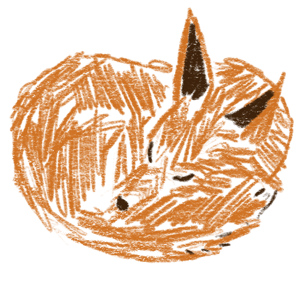

# 🦊 fux_berlin – Creator Portfolio Website

  

A modern portfolio website for Instagram content creator <strong>@fux_berlin</strong>, built with Next.js, React, TypeScript, Tailwind CSS, and shadcn/ui. 
Designed to showcase identity, past work, collaboration options, pricing, and selected Instagram content in a polished and professional way.

---

## 🔧 Tech Stack

  
   
  
  

---

## 📌 Project Overview

A modern portfolio website for Instagram creator **@fux_berlin**.  
Built to present identity, selected work, collaboration details, pricing, and Instagram posts presented inside elegant iPhone mockups.

---

## 🧠 Focus Areas

### **Frontend**

- Next.js App Router
- Modular React components
- Responsive UI with Tailwind
- shadcn/ui component system

### **TypeScript**

- Strong typing
- Structured models (pricing, content, gallery)

### **Design**

- Clean layout & consistent UI language
- Custom iPhone mockups for Instagram posts
- UX-first approach

### **Tooling & Structure**

- Organized folder architecture
- ESLint, Prettier, VSCode tooling
- Git & GitHub workflow

---

## 🎯 Learning Outcomes

- Practical use of the Next.js App Router
- Building scalable UI architecture
- Strengthened TypeScript skills
- Applying UX/UI fundamentals
- Introduction to animation with Framer Motion

---

## 📬 Contact

**Dominik Musewitsch**  
🔗 GitHub: [github.com/dominikmusewitsch](https://github.com/dominikmusewitsch)  
📧 Email: dmusewitsch@gmail.com
